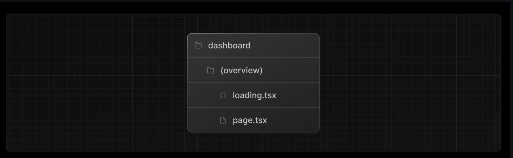

# NEXT JS NOTES 📝

### BENEFITS OF OPTIMIZING FONTS
In normal web dev there is a thing called <a>cumulative layout shift</a>..  what is this?
When a project has an external font from say google such as "Imperial", it has to fetch this font and then apply it after the web app has been built.
Meanwhile it fethces for this font there is a little gray area/time where another font/default font is seen, once "imperial" is applied the web app gets its desired font...
however there is a chance that certain elements may shift such as images, headers, titles because of this small change.
#### WHERE DOES NEXT JS COME IN?
Becuase next js allows us to optimize fonts in a way that the font is fetched and applied all the same time during build time, the user does not have to experience
this grey area of waiting for the font to be fethced and applied and so it rejects the possibility of __cumulative layout shift__.
 - next/font built in allows this to happen easily.

### BENEFITS OF OPTIMZING IMAGES 
With regular images the developer has to make sure of many things:
- Ensure your image is responsive on different screen sizes.
- Specify image sizes for different devices.
- Prevent layout shift as the images load.
- Lazy load images that are outside the user's viewport.

#### WITH NEXTJS _\<Image/>_ component:
- Preventing layout shift automatically when images are loading.
- Resizing images to avoid shipping large images to devices with a smaller viewport.
- Lazy loading images by default (images load as they enter the viewport).
- Serving images in modern formats, like WebP and AVIF, when the browser supports it.

#### 🧐SIDENOTE: What is lazy loading of images?
load images as they come within the viewport, outisde of nextjs, devs have to figure this out on their own, whilst nextjs has it as default behavior.

### PARTIAL RENDERING IN NEXT JS
Next js supports layout components for nested routes where partial re-renders occur meaning on navigation inside a nested route only the nested components/pages will re-render while the layout will not re-render
#### Possible through the _\<Link/>_ components in NestJS _\<Link/>_  component
Through the use of the link component the users experience feels similar to that of a react single page application where visiting other routes happen instantly without any page refresh, this is becuase of CODE-SPLITTING and PRETFETCHING done by NextJS.
- With code-splitting with routes means the if a route experiences an error the whoel app will not break.
- when a <Link/> component comes within the browsers viewport next js prefetches the code for that route and by the time the user clicks it, the transition happens near instant...
...making it seem just like a react single page application.

### HOW TO FETCH DATA
#### APIs
You can use api endpoints through route handlers in nextjs, which run on the server
this helps avoid fetching data directly from the client as we are not exposing our api/databse keys to the clients browser which can lead to a lot of negatives.

#### RSC REACT SERVER COMPONENTS

- supports asynchronous javascript, you dont have to use hooks and states
- runs in the server,
        <ul>
        <li> avoid sending critical key information to the browser</li>
        <li> avoid sending high computational fetches to the client and keep in server and only send results to client</li>
        </ul>
- since server components run on the server you can query a databse directly meaning you dont need an api layer.

### ORM vs SQL
Both are great at doing CRUD operations to a database however __ORMs__ write __SQL__ under the hood.

### REQUEST WATERFALLS
request waterfalls refers to a sequence of network requence where each sequential request depends on the previous.
this is something like this:

    const user = await fetchUserData();
    const bankAccountInfo = await fetchBankAccountInfo();
    const debt = await fetchDebt();
_user data --> get bank account details for 'user' --> get debt data from 'bank acount info'_

Where each of the request depend on the data returned by the previous request.

### PARALLEL DATA FETCHING
In some cases we dont want to use patterns thatll produce request waterfalls as this can be less efficient especially if no data relies on another request.
An alternative would be parallel data fetching, in JavaScript this is dnoe through the _Promise.all()_ or _Promise.allSettled()_ functions which can call all prmises at the same time(in parallel).

        const data = await Promise.all([
                invoiceCountPromise,
                customerCountPromise,
                invoiceStatusPromise,
        ]);

### NOTE: ISSUES WITH SUPABASE
Supabase does not yet seem to support the sql shorthand as:

        import {sql} from '@vercel/postgres';
        const data = await sql<Revenue>`SELECT * FROM revenue`;
In order to by pass this we can either 
- switch and revert to another database solution offered in vercel (neon)
- make a db connection first and then proceed to query

In order to make a db connection first we do:

        import { db } from '@vercel/postgres';
        const client = await db.connect(); 
        const data = await client.sql<Revenue>`SELECT * FROM revenue`;
💡Solution thanks to lovely guy on <a href='https://screen.studio/share/dg7ZYizd'>reddit</a>.

### STATIC RENDERING
With static rendering, data fetching and rendering happens on the server at build time (when you deploy) or when revalidating data.

When a user visits your application the cached results are served from the CDN(Content Delivery Network).

#### 💡What are cached results?
Caching done by the CDN works by serving as a intermediary between the user and the server where instead of having the user request for data located all the way in ther server(which may be located far, adding to request fetch time), the user is served prebuilt and prefetched data from the CDN for faster and more efficient load/fetch times.
However given that some data is bound to change the cache which can be stored in different geographical locations; clear themselves and request new updated data from the server every so often(whenever theyre scheduled to).

__caches becomes even more useful when the user wants to go into other nested routes or comes back at a later date to visit the same site as they are returned cached results in quick time__

__The cache/CDN has all prefetched data for your application allowing for quick near instant accesibility time of routes__

        /customers
        /customers/id
__\*if for some reason it does not have the data needed to build the /customer/id route it will go back and fetch for it from the server and keep it for future requests*__

In this aspect caching works well in _static rendering_ of blogs, personal portfolios, marketing pages because these applications dont have data updating as often.

### DYNAMIC RENDERING
With dynamic rendering, content is rendered on the server for each user at request time (when the user visits the page). There are a couple of benefits of dynamic rendering:

- Real-Time Data - Dynamic rendering allows your application to display real-time or frequently updated data. This is ideal for applications where data changes often.
- User-Specific Content - It's easier to serve personalized content, such as dashboards or user profiles, and update the data based on user interaction.
- Request Time Information - Dynamic rendering allows you to access information that can only be known at request time, such as cookies or the URL search parameters.

### Streaming Data
Streaming is a data transfer technique that can be used as a solution to _slow data request_ from blocking the whole page being loaded and usable.

Streaming allows an application to be broken down into smaller _chunks_ (in react these cna be thought of as the components themselves) and as chunk data is fetched they will be loaded.

Streaming allows for the application to be viewed even if all components/chunks are not yet available or interactable.

__Streaming helps reduce the overall load time of an application__

"By streaming, you can prevent slow data requests from blocking your whole page. This allows the user to see and interact with parts of the page without waiting for all the data to load before any UI can be shown to the user."

Implementation of Streaming in NextJS:
- loading.tsx file, for entire pages.
- \<Suspense> component,going a more 'granular' approach with specific components.

#### loading.tsx
loading.tsx is a builtin NextJS file that serves as the fallback component before being replaced by dynamic data after fetching is complete.

Since static components can be shown in conjunction with loading skeletons(Streaming), the user does not have to wait till the loading skeletons from loading.tsx is loaded to be able to interact with the static components.

. ex: user can use navbar(static) to navigate away before dashboard(dynamic) is finished loading, this is called __interuptable navigation__.

### Route Groups
Route groups can be used to seperate files into logical groups.  If we only want skeletons/loading components to apply to specific page we can can nest these files in a folder '(overview)'

_Our loading.tsx will only apply to page.tsx in this instance_

_( ) does not affect the URL path so in this instance the url is still /dashboard_

### Component Grouping
Sometimes certain components may make a popping pattern when data fetching is done and it is time to render which can offput the user. (ex: card components in an eccomerce store displaing multiple products in the same format).

__To avoid this__ we can group components by surrounding them in a wrapper component, and have the wrapper component be surrounded by a __Suspense__ component, where the user will see a skeleton until the wrapper containing all components is ready to render.

### Deciding when to use \<Suspense/> boundaries can improve user experience
Where you place your Suspense boundaries will depend on a few things:
- How you want the user to experience the page as it streams.
- What content you want to prioritize.
- If the components rely on data fetching. By moving data fetching down from the parent component to the component itself you are able to use Suspense and provide a more granular rendering pattern and further prevent UI blockage.

"Where you place your suspense boundaries will vary depending on your application. In general, it's good practice to move your data fetches down to the components that need it, and then wrap those components in Suspense. But there is nothing wrong with streaming the sections or the whole page if that's what your application needs."

